# Règlement

Cette année, les robots remontent le temps à la découverte de la Préhistoire ! Dans cet univers hostile, ils vont devoir user de stratégie et de courage pour mener à bien les missions qui les attendent…

Les missions :

- La fresque : les robots doivent marquer l’Histoire de leur empreinte.
- La conquête du feu : les robots doivent s’approprier le plus de feux.
- La cueillette : les robots doivent cueillir le plus de fruitmouths possibles.
- Les mammouths : les robots doivent envoyer le plus de lances possibles sur les mammouths.
- Capture des mammouths : les robots peuvent capturer un mammouth à la fin du match.

Le règlement complet est disponible ici : [Règlement officiel Eurobot 2013](Rules2014VersionfinaleEurobot.pdf)

# Cro-Minion

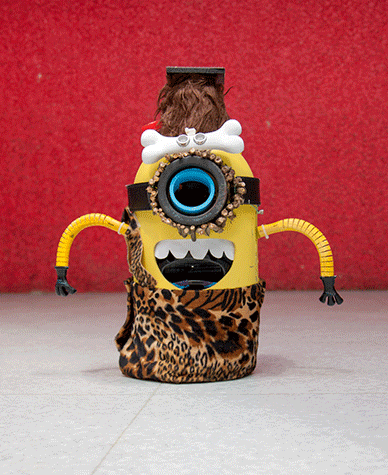

Parfait croisement entre un Minion et un homme de cromagnon, ce robot est un tueur ! Munie d'un canon optique mortel, les mammouths ne lui résistent pas. Il suis sa trajectoire à la ligne, s'arrête poliment devant ses adversaires et agite les bras pour les repousser. 

Niveau équipement, notre cro-minion est armé d'une [Teensy 3.1](http://www.pjrc.com/store/teensy31.html "Teensy 3.1"): la puissance d'un ARM 32bits avec la facilité de programmation d'un arduino.

Pour garder la ligne, de simples capteurs optiques placés sous son pagne en peau de bêtes (aucun animal non synthétique n'a été bléssé). Ses roues et moteurs lui ont été gentillement prêté par un aspirateur [neato XV-11](http://www.neatorobotics.com/series/xv/) et il a arraché sa coque à un [pulvérisateur](http://www.leroymerlin.fr/v3/p/produits/pulverisateur-a-pression-prealable-e42621) de passage !

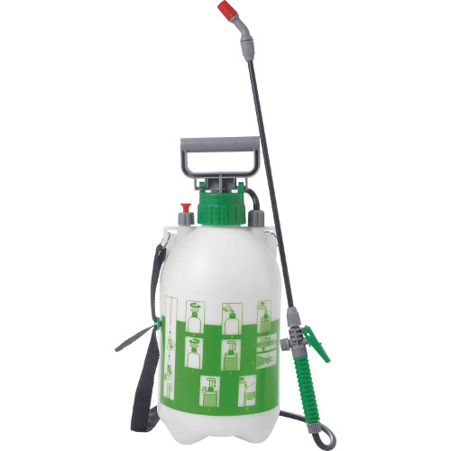

##Conception

Les 1ères ébauches de Cro-Minion a l'automne 2013 :

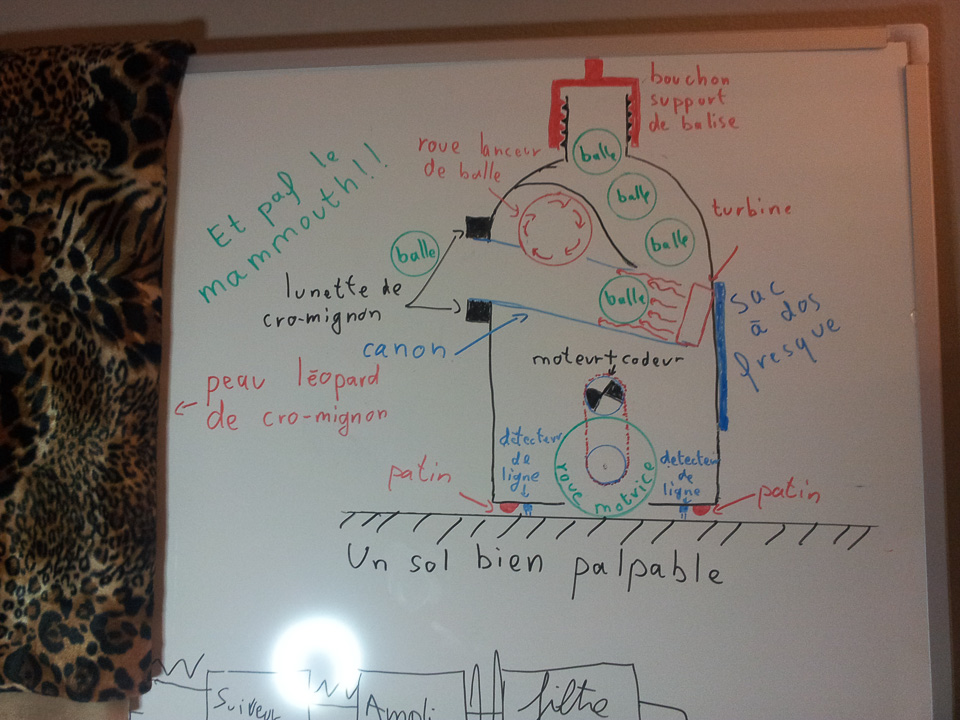

Petite vidéo de la bestiole en action: [http://www.youtube.com/watch?v=HT-f-Wlzdz4](http://www.youtube.com/watch?v=HT-f-Wlzdz4)

Un second robot avec une trompe était prévu envisagé :
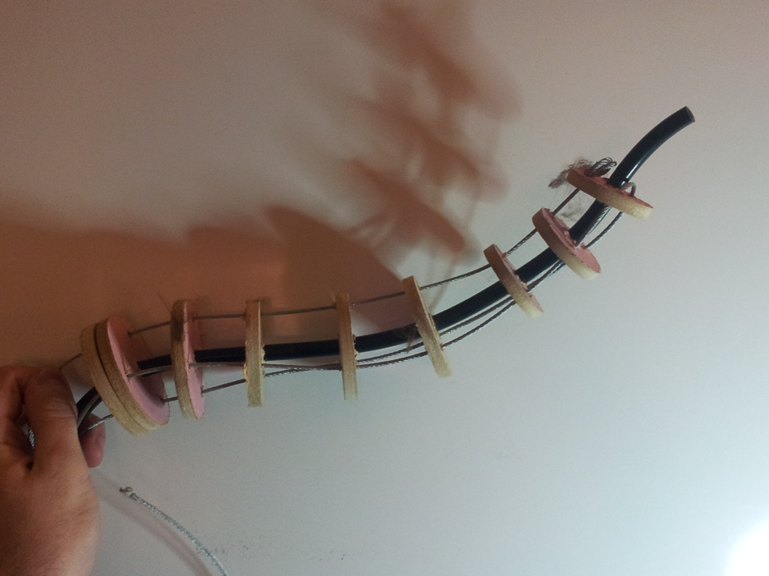

##Les dessous de Cro-Minion
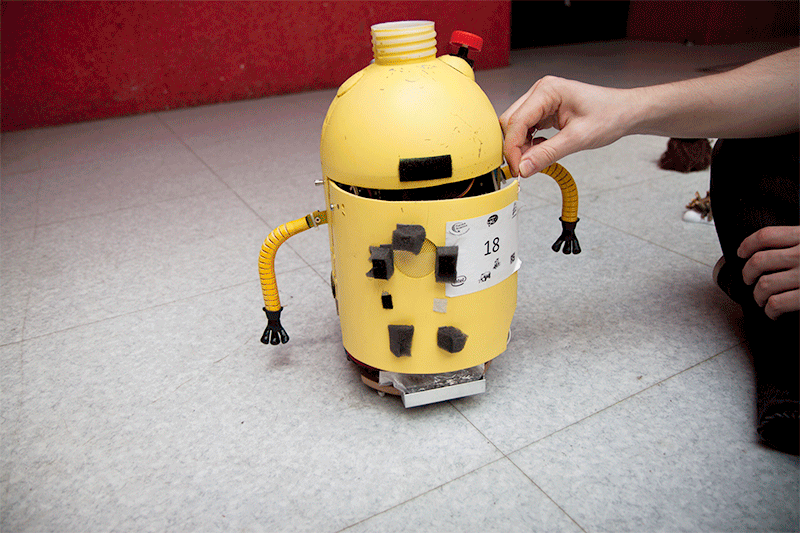

###L'électronique

Nous sommes partis sur un modèle similaire à l'année précédente. Une Raspberry Pi s'occupe de la stratégie et du code haut niveau. Toute la stratégie est codée en python 3 et tourne sur Raspbian.

Les traitement temps réel (asservissement principalement) sont assurés par une carte [Teensy 3.1](http://www.pjrc.com/store/teensy31.html "Teensy 3.1"). Auparavant sur Arduino/AVR, nous avons pu porter notre code en moins de 24h sur cette carte tout en gagnant fortement en temps de calcul (96MHz, 32bits et...FPU !!!).

Les ponts en H sont ceux qui étaient utilisés dans l'aspirateur d'où sont issus nos moteurs, des petits chips [A3950](http://www.allegromicro.com/~/Media/Files/Datasheets/A3950-Datasheet.ashx). Moins encombrants que les LMD18200 utilisés l'an dernier, mais uniquement adapté pour des moteurs à faible courant (pour les robots pépères !).

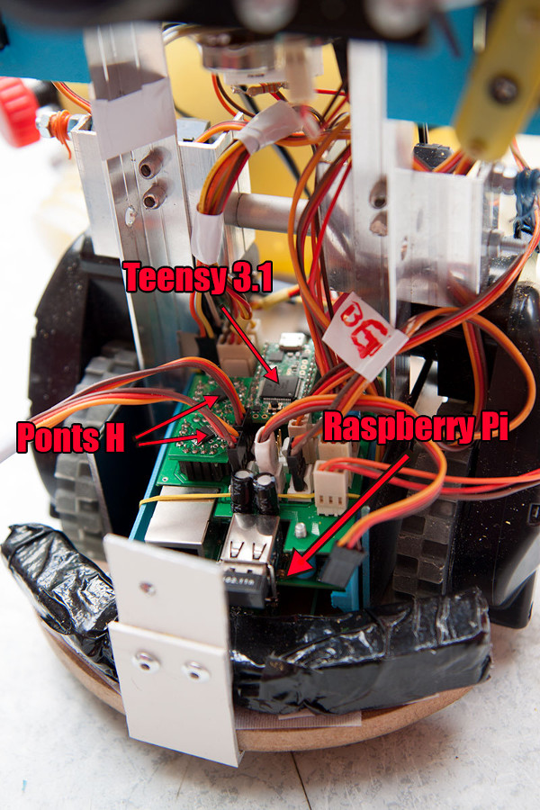

###Le canon a balles

Mécanisme assez classique, les balles passent sous une roue qui tourne à haute vitesse et sont propulsées vers l'avant.

Le tube, le support du moteur et les différents carters de guidage des balles ont tous été imprimés en 3D. Ce mécanisme étant situé dans la partie sphérique de la tête il fallait optimiser l'espace au maximum.

Au fond du tube, un ventilateur aide les balles à remonter jusqu'à la roue (une sorte d'inverseur de gravité low-cost en quelque sorte).

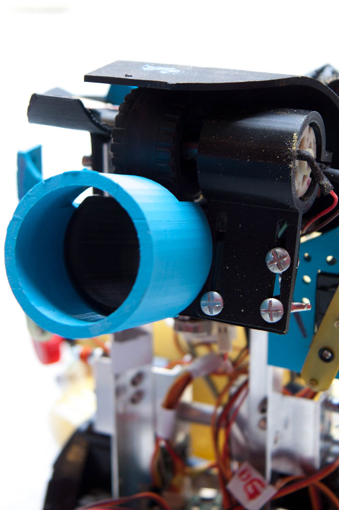

Oui, c'est bien une roue de mécano !

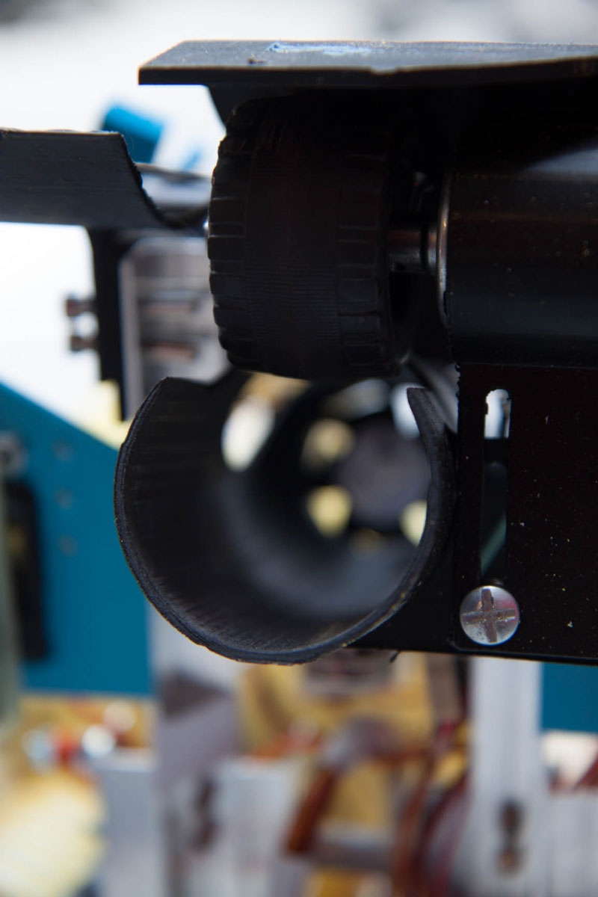

Ce tube bleu permet de rallonger le tube du canon tout en facilitant le démontage de la coque (qui coulisse vers le haut).

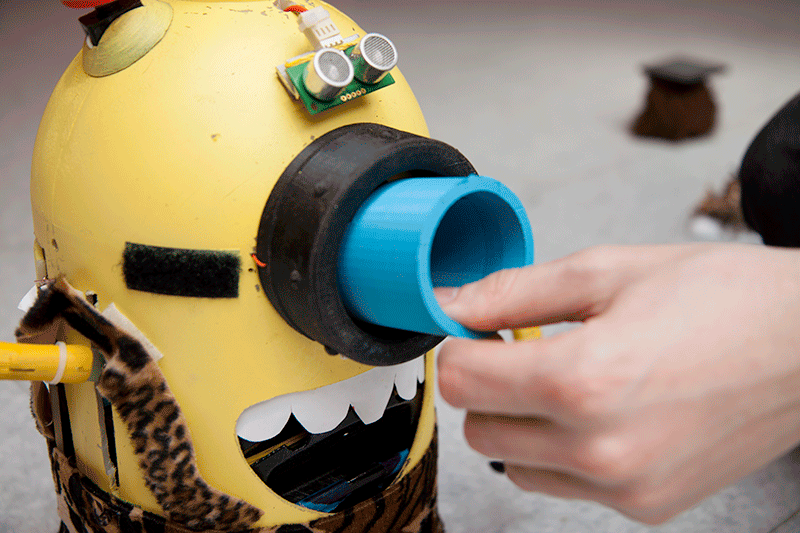

Le ratatouilleur ! derrière ce nom technique se cache le mécanisme qui remue les balles pour éviter qu'elles ne se coincent les unes sur les autres.

Pour économiser une sortie sur la carte mère, les deux servo-moteurs sont réliés sur un cable en Y.

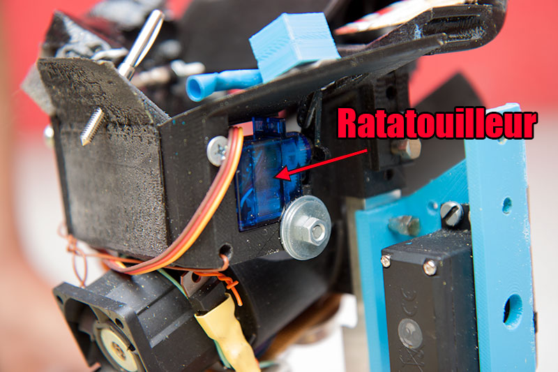

Malgré l'agitation des servomoteurs, les balles avaient encore tendance à rester bloquées...quelques bouts de scotchs, plastique ou carton de plus ont aidé un peu mais le canon n'était vraiment pas fiable.

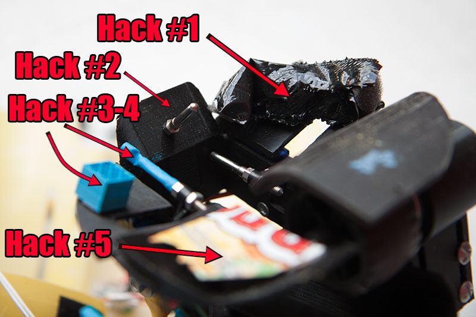

Réalisé le jour de la fête des mère, la décoration des lunettes possède quelques similitudes avec un collier de pâtes.

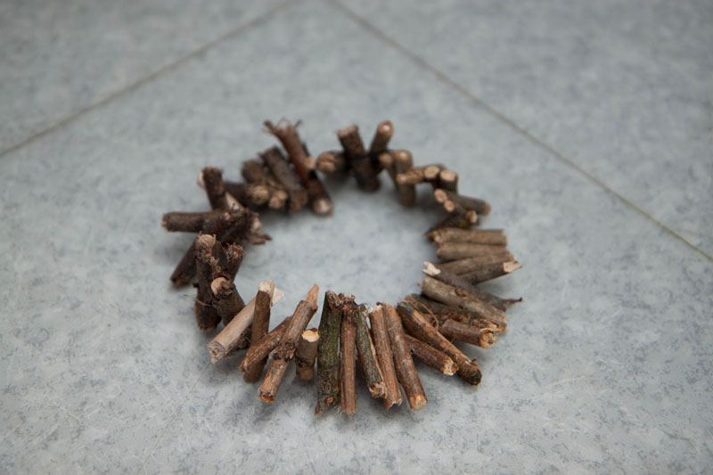

###Le lance filet

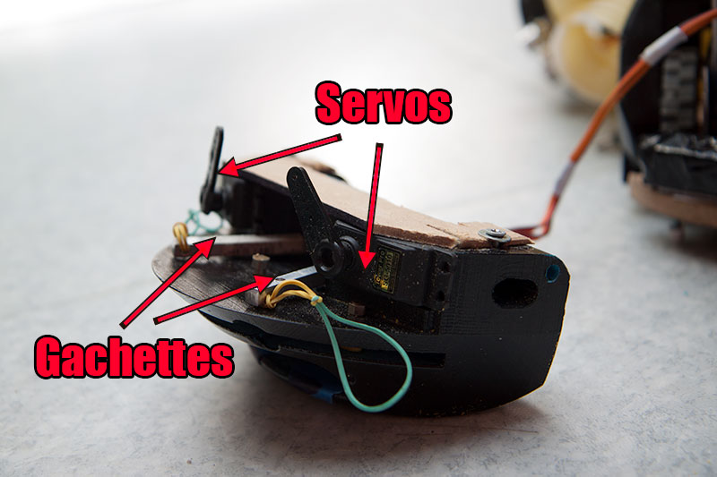

###Les ultrasons

Un classique SRF05 dans son nonos.

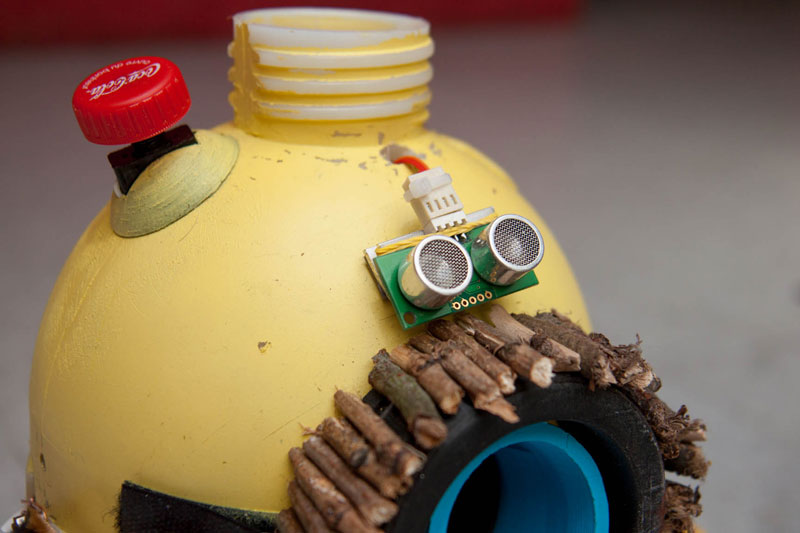
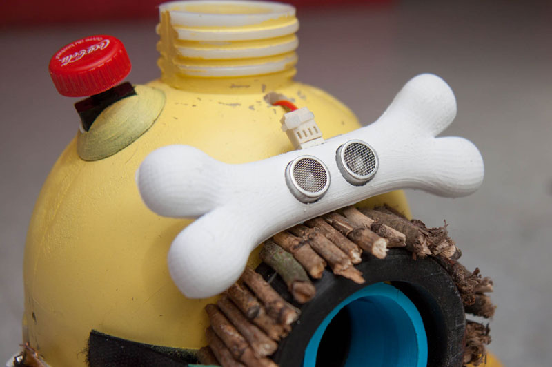

###Les bras

Les bras, instruments indispensables pour effrayer les ennemis, ont été réalisés à partir de serpents en bois découvert par hasard dans un super-marché.

Les mains ont été imprimées en 3D puis peintes en noir à la bombe.

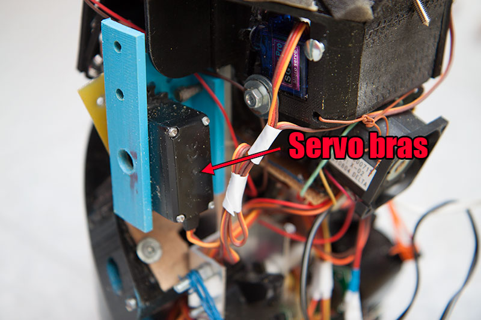

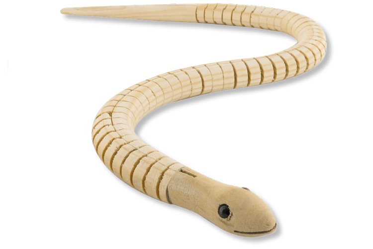

###Les dents

Difficile de faire plus simple : une feuille de papier blanc, une paire de ciseaux et voilà ! 

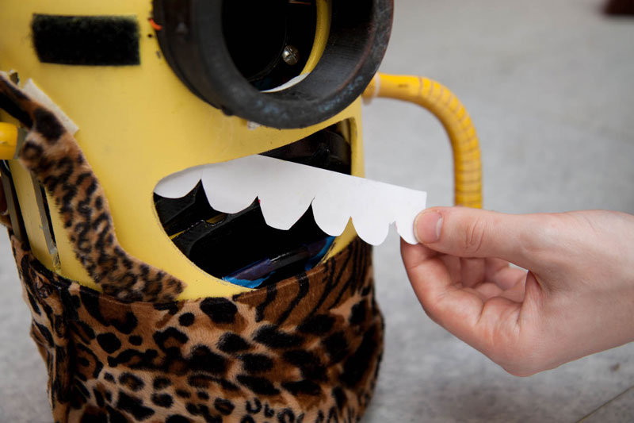
