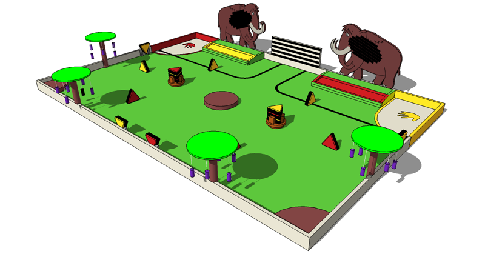
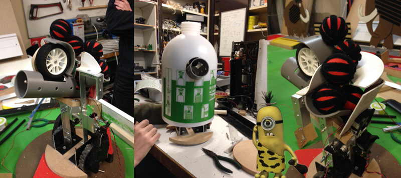

# Règlement

Cette année, les robots remontent le temps à la découverte de la Préhistoire ! Dans cet univers hostile, ils vont devoir user de stratégie et de courage pour mener à bien les missions qui les attendent…

Les missions :

- La fresque : les robots doivent marquer l’Histoire de leur empreinte.
- La conquête du feu : les robots doivent s’approprier le plus de feux.
- La cueillette : les robots doivent cueillir le plus de fruitmouths possibles.
- Les mammouths : les robots doivent envoyer le plus de lances possibles sur les mammouths.
- Capture des mammouths : les robots peuvent capturer un mammouth à la fin du match.

Le règlement complet est disponible ici : [Règlement officiel Eurobot 2013](Rules2014VersionfinaleEurobot.pdf)

# Les robots

## Cro-Minion

Parfait croisement entre un Minion et un homme de cromagnon, se robot est un tueur ! Munie d'un canon optique mortel, les mammouths ne lui résistent pas. Il suivra sa trajectoire à la ligne et s'arrêtera poliment devant ses adversaires.  

Niveau équipement, notre cro-minion est armé d'une [Teensy 3.1](http://www.pjrc.com/store/teensy31.html "Teensy 3.1"): la puissance d'un ARM 32bits avec la facilité de programmation d'un arduino. Pour garder la ligne, de simples capteurs optiques placés sous son pagne en peau de bêtes (aucun animal non synthétique n'a été bléssé). Ses roues et moteurs lui ont été gentillement prêté par un aspirateur [neato XV-11](http://www.neatorobotics.com/ca_fr/product/xv-11/) et il arraché sa coque à un [pulvérisateur](http://www.leroymerlin.fr/v3/p/produits/pulverisateur-a-pression-prealable-e42621) de passage !

Petite vidéo de la bestiole en action: [http://www.youtube.com/watch?v=HT-f-Wlzdz4](http://www.youtube.com/watch?v=HT-f-Wlzdz4)

## Gobymouth

Encore à l'état de spermatozoïde, ce robot aura une trompe ! Sa mission sera les feux et la cueillette des fruitmouths. Grâce à sa trompe articulée, Gobymouth tentera de récolter des fruits le tout avec style !