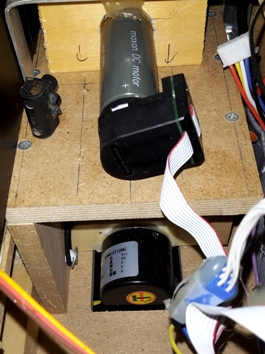

# Règlement

Devenir une star du grand écran n’est pas de tout repos : il ne suffit pas de jouer la comédie !

Les robots en feront l’expérience cette année, et devront nous prouver leurs multiples talents dans un tournage hors du commun.

Les missions :

- Le spot : les robots doivent installer des spots le plus haut possible pour éclairer les acteurs.
- Le clap : les robots doivent refermer les claps de leur film.
- Le pop-corn : les robots doivent récupérer un maximum de pop-corn. Ils pourront les déposer dans leurs bacs à pop-corn, ou remplir des gobelets à mettre dans leurs salles.
- Le tapis rouge : les robots doivent installer le tapis rouge sur les marches pour accueillir les artistes.
- La montée des marches : les robots doivent se placer au sommet des marches à la fin du match.

Le règlement complet est disponible ici : [Règlement Français Eurobot 2015](C2015_Reglement_FR_final.pdf)

# Rosebot, le robot de l'équipe toulousaine

Pour leur première participation, l'équipe toulousaine a tout à faire.
Beaucoup d'idées, une imagination débordante ont fini par faire place à la raison et au temps.

Nous sommes résignés à revoir nos objectifs et à faire un robot minimaliste (désolés pour ceux qui attendaient à voir un autre minion).
Détaillons ensemble ce robot...

## La conception

La base roulante ainsi que les blocs moteurs ont été conçus sur [FreeCAD](www.freecadweb.org/?lang=fr_FR)
et usinées à la faiseuse numérique à partir de MDF.
Cela nous a permis d'obtenir un assemblage précis et sans trop de surprises.

De même pour la pince du robot, usiné dans du PVC.
Mais l'ensemble a nécessité un peu de travail manuel,
tel que l'assemblage de la glissière de l'ascenseur ou le thermoformage d'une gouttière.

Enfin, tout le volume du robot ("la coque") a été fait à la main à partir de cornière alu, scie et pince à riveter.

## La base roulante

La base roulante est équipée d'un châssis en MDF comportant 3 billes porteuses,
ainsi que de 2 blocs moteurs composés de chacun d'un moteur Maxon couplé à un codeur incrémental de 400pts/tour.

Pour compléter cet ensemble et boucler la boucle de l'asservissement,
les blocs moteurs sont commandés par une carte Nucleo que nous aborderons ci-après.

## L'électronique

Notre robot est alimenté par une batterie [LiFe 4200mAh 13.2V](http://www.hobbyking.com/hobbyking/store/__14067__ZIPPY_Flightmax_4200mAh_4S2P_30C_LiFePo4_Pack.html)
qui permet de distribuer les tensions suivantes 12V (actionneurs), 9.6V (actionneurs) et 5V (calcul et capteurs)

Les actionneurs utilisés (le bras pour le tapis, et ceux pour la pince)
sont des servomoteurs analogiques de position ou de vitesse (sans buttées).

Au niveau capteurs, nous utilisons des télémètres infrarouge sharp GP2Y0A21 pour l'évitement
et des fin de course pour connaitre différents états du robot (principalement pour la pince).
Si vous avez pris le temps de nous lire depuis le début (et aussi sur les posts),
vous aurez devinez que la pince est un système à part entière.

Bon, ben, on a fait le tour...
Je vous remercie de nous avoir lu.

Quoi, qu'est ce que j'entends? Des râles?

Ah oui, j'oubliais, les cartes de calcul. Le cerveau du robot! (ben, pour moi, je ne dois pas en avoir)

Nous avons à gauche, une carte [Nucleo-F401RE](https://developer.mbed.org/platforms/ST-Nucleo-F401RE/)
équipé d'un [shield arduino moteur 2A](http://www.alpha-crucis.com/fr/shields/44-shield-de-commande-de-moteur-2a-pour-arduino-3700386610097.html).
Cet ensemble s'occupe exclusivement de l'asservissement (lecture des codeurs & commande des moteurs) et de la détermination de la position.
Elle reçoit, de la carte [Edison](http://www.intel.com/edison/getstarted) (à droite), des commandes de déplacement en position ou en vitesse via un lien série.
Régulièrement, la Nucleo est interrogée pour connaitre la position du robot.

Tous les autres capteurs (fins de course et sharps) et les autres actionneurs (servomoteurs) sont interfacés sur la carte Edison.
Tout cela est orchestré par [ROS](http://www.ros.org/).

Je pense que le tour est terminé?    silence...   

En tout cas, si vous avez des questions, n'hésitez pas à nous [contacter](apropos.html).
Et retrouvez ce descriptif sous forme de poster technique [ici](https://drive.google.com/open?id=0Bwy5dKRLqqGhX1cxWWwtTXpKdG8).

Toute l'équipe toulousaine vous remercie de nous avoir suivis.

