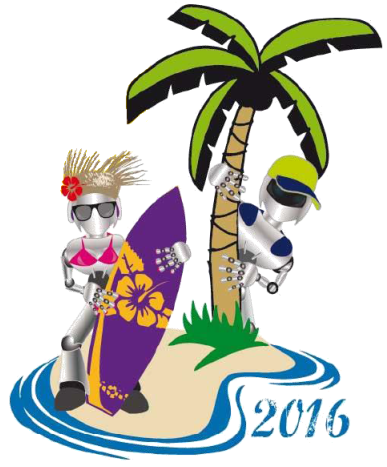
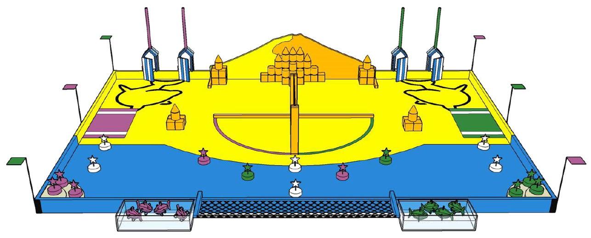

# Règlement

Devenir une star du grand écran n’est pas de tout repos : il ne suffit pas de jouer la comédie !

Les robots en feront l’expérience cette année, et devront nous prouver leurs multiples talents dans un tournage hors du commun.

Les missions :

- Le spot : les robots doivent installer des spots le plus haut possible pour éclairer les acteurs.
- Le clap : les robots doivent refermer les claps de leur film.
- Le pop-corn : les robots doivent récupérer un maximum de pop-corn. Ils pourront les déposer dans leurs bacs à pop-corn, ou remplir des gobelets à mettre dans leurs salles.
- Le tapis rouge : les robots doivent installer le tapis rouge sur les marches pour accueillir les artistes.
- La montée des marches : les robots doivent se placer au sommet des marches à la fin du match.

Le règlement complet est disponible ici : [Règlement Français Eurobot 2016](C2016_Rules_FR.pdf)
Nota: Une modification importante a été apportée au règlement. Retrouverez cette modification [ici](http://www.planete-sciences.org/forums/viewtopic.php?f=88&t=17096)