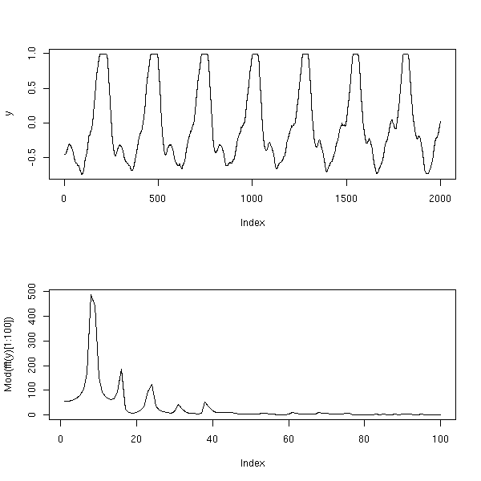

# Qu'est ce que la TFD (Transformée de Fourier Discrète) ? #

>
> La transformation de Fourier discrète (TFD) est un outil mathématique de traitement du signal numérique, qui est l'équivalent discret de la transformation de Fourier continue qui est utilisée pour le traitement du signal analogique. [[Wikipedia](http://fr.wikipedia.org/wiki/Transformation_de_Fourier_discr%C3%A8te)]
>

Si la TFD est l'équivalent discret de la Transformée de Fourier, mais alors, qu'est ce que la Transformée de Fourier.

>
> En analyse, la transformation de Fourier est une extension, pour les fonctions non périodiques, du développement en série des fonctions périodiques de Fourier. [[Wikipedia](http://fr.wikipedia.org/wiki/Transformation_de_Fourier)]
>

Et si la Transformée de Fourier est l'extension pour des fonctions non périodique de la série de Fourier, mais qu'est ce que c'est que cette série de Fourier.

>
> En analyse, les séries de Fourier sont un outil fondamental dans l'étude des fonctions périodiques. C'est à partir de ce concept que s'est développée la branche des mathématiques connue sous le nom d'analyse harmonique. [[Wikipedia](http://fr.wikipedia.org/wiki/S%C3%A9rie_de_Fourier)]
>

Pour résumer, la TFD permet d'analyser un signal *non périodique* (signal temporel quelconque) de manière *discrète* (on va donc discrétiser le signal) sous forme *harmonique* (on va étudier la *puissance* de chaque *fréquences* qui composent le signal).

# Pourquoi utiliser la TFD ? #

Pour la conception de [balise pour le robot](/projets/balise) ou d'[un système de déclenchement automatique d'appareil photo](/projets/autophoto) il est nécessaire d'encoder les informations. Mais qui dit encodage, dit aussi décodage.

Dans les 2 cas cités au dessus, l'encodage est simple, un signal en forme de créneau est envoyé à une fréquence particulière. Le décodage consiste à dire si oui ou non cette fréquence arrive dans le récepteur.

Après beaucoup d'essais infructueux avec des filtres analogiques (résistances, condensateurs, ampli-OP), la solution d'un système de décodage numérique a été envisagée.

Pourquoi la TFD et pas un filtre numérique ou autres ? Les filtres numériques sont actuellement à l'étude (pour voir leurs efficacités). Mais au moment où le décodage numérique a été choisi, il y avait un manque de temps, et surtout, un système qui fonctionnait très bien avec la TFD : La FFT (Fast Fourier Transform ou Transformation de Fourier Rapide qui est un algorithme de calcul de la TFD) sur l'oscilloscope numérique.

Voila pourquoi c'est la TFD qui a été choisie, analysé et implémenter

# Que fait exactement la TFD ? #

La TFD est un formule mathématiques qui permet de *transformer* un signal temporel en un signal *fréquentiel*.

Ainsi, au lieu d'avoir une tension qui dépend du temps (le signal de base que l'on a l'habitude de voir à l'oscilloscope), nous avons des *amplitudes* de fréquences (la FFT sur un oscilloscope numérique).

Ci-dessus, un exemple qui montre le signal temporel (signal du dessus) et sa transformée de Fourier (signal du dessus).

# Les formules #

Pour calculer la TFD, il est nécessaire d'avoir une bonne notation, et de bien comprendre tous les éléments qui entrent en jeu :

* Le nombre total d'échantillon (point que l'on a mesuré) est noté $$N$$
* Pour avoir des échantillons, il nous faut une fréquence d'échantillonnage $$F_e$$
* On note $$s(n)$$ la valeur du signal échantillonné pour le point $$n$$
* Nous pouvons, au maximum, calculer $$N$$ valeurs de Fourier. Le nom choisi pour ces valeurs (allant de $$0$$ à $$N$$) est $$k$$. Et à chacune de ces valeurs correspond une fréquence noté $$f_k$$
* La valeur de Fourier pour un $$k$$ donné est noté $$S(k)$$ (et il s'agit d'un nombre complexe).
* L'amplitude fréquentiel (la valeur qui nous intéresse) est le module de la valeur complexe : $$\Vert{S(k)}\Vert$$
* On notera tout simplement $$f$$ la fréquence que l'on souhaite identifier
* La précision spectrale (fréquence entre chacun des coefficients) sera notée $$\delta_F$$

Par exemple, nous allons échantillonner un signal à $$F_e = 100kHz$$ sur 128 points ($$N = 128$$). On aura ainsi 128 mesures d'amplitude (allant de $$S(0)$$ à $$S(127)$$) associées à 128 fréquences (allant de $$f_0$$ à $$f_{127}$$).

Maintenant que la notation est claire, nous allons pouvoir voir les formules intéressantes :

1. Nous avons $$S(k) = \sum_{n=0}^N s(n)e^{(-2i{\pi}{k}\frac{n}{N})}$$ pour $$0 {\leq} k < N$$
2. Monsieur Shannon nous dit que la fenêtre d'échantillonnage doit être strictement supérieur à deux périodes du signal échantillonné. En terme mathématiques, cela signifie que : $$N{\frac{1}{F_e}}>2{\frac{1}{f}}$$
3. Il existe un lieu entre le coefficient $$k$$ et sa fréquence associée $$f_k=\frac{F_e}{N}k$$ : 
4. La précision spectrale peut se calculer de la manière suivante : $${\delta}_{F}=\frac{F_{e}}{N}$$
5. La fréquence d'échantillonnage doit être supérieure à la fréquence à mesurer. J'ai choisi $$F_e{\geq}10f$$

# Ce qu'il faut retenir #

Prenons un exemple. Nous avons un signal à 7kHz qui arrive sur un récepteur (exemple du déclencheur d'appareil photo), et nous voulons mesurer son *amplitude* d'arrivé sur le capteur. De plus, petite contrainte supplémentaire, on va supposer que pour une futur évolution du projet, nous aurons d'autres signaux qui arriveront (à 6kHz et 8kHz).

Nous allons choisir une fréquence d'échantillonnage $$F_e=100kHz$$. Le point (5) est bien respecté.

Nous avons besoin d'une précision spectrale de 500Hz minimum (1kHz entre chaque fréquence, soit une précision de plus ou moins 500Hz) : $${\delta}_{F}<500$$.
Le point (4) nous dit que $${\delta}_{F}=\frac{F_{e}}{N}$$. On peut donc déduire que $$\frac{F_{e}}{N}<500$$ ==> $$N>\frac{F_e}{500}=200$$. Il nous faudra donc au moins 200 points pour avoir la précision souhaité.

Le point (2) dicté par Mr. Shannon dit que $$N{\frac{1}{F_e}}>2{\frac{1}{f}}$$. Dans notre cas : $$N>2{\frac{F_e}{f}}$$. Pour 8kHz, $$N>25$$ et pour 1kHz, $$N>200$$.

En prenant 256 points, les points (2) et (5) sont respectés.

Il ne reste alors plus qu'à trouver les bons coefficients à calculer pour la fréquence 7kHz. En utilisant la formule du point (3), nous obtenons k=17.92. Comme nous pouvons prendre que des nombres entiers, nous allons choisir k=18, pour une fréquence de 7031Hz.

-----------------------------------------

On retiendra de cet exemple que les points (2), (3), (4) et (5) servent à choisir les bons paramètres (fréquence d'échantillonnage et nombre de points).

Enfin, le point (1) permettra de calculer l'amplitude de l'harmonique à la fréquence choisie.

# Implémentation sur un arduino #

## Echantillonnage ##

La première chose à faire, est d'échantillonner notre signal. Pour cela, nous allons utiliser un Timer (librairie Timer3) et la lecture analogique du signal pour stocker le résultat dans un buffer circulaire.

On commence par définir une structure pour avoir un buffer circulaire.

// Définition du nombre de points à échantillonner
#define SAMPLE_SIZE 256

// Création de la structure du Buffer circulaire
typedef struct FFTRingBuffer {
	uint16_t buffer[SAMPLE_SIZE];
	uint8_t head;
} FFTRingBuffer;


Une fois la structure du buffer définie, il faut créer le buffer et l'initialiser.

volatile FFTRingBuffer FFTbuffer;
FFTbuffer.head = 0;


L'option volatile permet d'éviter des erreurs du compilateur. Sans cette option, avec les optimisations du compilateur, il risque de se rendre compte que ce buffer n'est jamais mis à jour par appel de fonction, et donc, de remplacer la variable par des constantes pour optimiser le programme. Hors, ce buffer sera mis à jour dans des interruptions.

Il suffit d'initialiser uniquement le pointer de tête du buffer circulaire (on sera juste que tant que les 255 premiers points n'ont pas été échantillonné, les valeurs de TFD calculées seront fausses).

Ensuite, nous activons le Timer3 pour vraiment échantillonner le signal

// On inclut la librairie TimerDue car le code fonctionne sur un arduino Due
#include <DueTimer.h>

// Définition de la fréquence d'échantillonnage
#define FREQ_SAMPLE_RATE 100000

// Fonction qui sera appelée par le Timer 3
void handlerTimerAnalogRead()
{
	// On stocke la valeur analogique du signal dans le buffer circulaire
	FFTbuffer.buffer[FFTbuffer.head] = analogRead(A0);

	// On incrémente le pointeur de tête du buffer
	FFTbuffer.head = (FFTbuffer. head + 1 ) % SAMPLE_SIZE;
}

// Lancement du Timer à la fréquence souhaitée avec un appel à la fonction voulue
Timer3.attachInterrupt(handlerTimerAnalogRead).setFrequency(FREQ_SAMPLE_RATE).start();


Et voila, nous avons un système qui échantillonne le signal (conversion analogique numérique) à une fréquence fixe et précise (créée par Timer).

La librairie du Timer utilisé est [DueTimer](https://github.com/ivanseidel/DueTimer) car ce code est fait pour fonctionner sur arduino Due. Cependant, il est facile de porter le code pour un arduino standard.

## Calcul de la TFD ##

Pour le calcul d'un coefficient de la TFD, il suffit d'appliquer la formule :

$${\Vert}S(k){\Vert}={\Vert}\sum_{n=0}^N s(n)e^{(-2i{\pi}{k}\frac{n}{N})}{\Vert}$$

On passe de l'écriture exponentiel complexe à l'écriture trigonométrique :

$${\Vert}S(k){\Vert}={\Vert}\sum_{n=0}^N s(n)[\cos(-2{\pi}{k}\frac{n}{N})+{i}\sin(-2{\pi}{k}\frac{n}{N})]{\Vert}$$

On sépare les sommes :

$${\Vert}S(k){\Vert}={\Vert}\sum_{n=0}^N s(n){\cos}(-2{\pi}{k}\frac{n}{N}) + {i}\sum_{n=0}^N (n){\sin}(-2{\pi}{k}\frac{n}{N})]{\Vert}$$

On pose $$R=\sum_{n=0}^N s(n){\cos}(-2{\pi}{k}\frac{n}{N})$$ et $$I=\sum_{n=0}^N (n){\sin}(-2{\pi}{k}\frac{n}{N})]$$

On a donc $${\Vert}S(k){\Vert}={\sqrt{R^2+I^2}}$$

Maintenant, passons à l'implémentation sur arduino :

// Création d'un buffer local
uint16_t buffer[SAMPLE_SIZE];
unsigned long i;
// On stoppe les interruptions le temps de copier en local le buffer circulaire
cli();
for (i = 0; i < SAMPLE_SIZE; ++i)
{
	buffer[i] = FFTbuffer.buffer[(FFTbuffer.head+i) % SAMPLE_SIZE];
}
// On réactive les interruptions
sei();

// Création de la partie Réel et Imaginaire du coefficient (le R et I de tout à l'heure)
double real = 0, img = 0;

// Pour essayer de garder au mieux la même notation que les formules, on pose k = 18 la valeur de l'amplitude que l'on souhaite mesurer.
unsigned long k = 18;
// Toujours pour la même raison, on pose n l'indice de la somme
unsigned long n;
// Le N que nous avions dans les formules est remplacé ici par SAMPLE_SIZE
for (n = 0; n < SAMPLE_SIZE; ++n)
{
	real += buffer[n] * cos(-2 * 3.14 * k * n / SAMPLE_SIZE);
	img += buffer[n] * sin(-2 * 3.14 * k * n / SAMPLE_SIZE);
}

// On calcul le résultat
double result = sqrt( real * real + img * img );


Nous venons de calculer l'amplitude du signal pour le coefficient K = 18 (fréquence 7031Hz dans notre exemple).

## Optimisation ##

Quelques optimisations peuvent être apportées à notre algorithme pour aller plus vite sur un arduino (car il y a peu de puissance de calcul sur un arduino).

La plus simple des optimisations est de ne pas calculer la racine du signal, mais de garder la valeur élevée au carré. il suffira alors de comparer le résultat avec notre valeur de comparaison elle aussi élevée au carré.

double result = real * real + img * img;


La seconde optimisation, plus complexe mais plus efficace, consiste à créer un tableau de sinus et cosinus. En effet, nous calculons SAMPLE_SIZE (256 dans notre exemple) le sinus et cosinus de (-2 * pi * k * n / SAMPLE_SIZE).

// Création du tableau de cosinus sous forme de constante
const double fft_cos_table[SAMPLE_SIZE] = {1,0.98917651,0.956940336,0.903989293,0.831469612,0.740951125,0.634393284,0.514102744,0.382683432,0.24298018,0.09801714,-0.049067674, ...};

// Création de la fonction pour récupérer la valeur
double cos_table(uint8_t k)
{
	return fft_cos_table[k];
}

...

for (n = 0; n < SAMPLE_SIZE; ++n)
{
	// Utilisation des tableaux de sinus et cosinus
	real += buffer[i] * cos_table(i);
	img += buffer[i] * sin_table(i);
}


Cette fois-ci, nous avons créé un tableau de cosinus pré-calculé pour le coefficient K=18 et pour 256 points (avec un tableur sur l'ordinateur) et stocké les résultats dans l'arduino. Ainsi, nous évitons les calculs suivants :

* Une multiplication de nombre flottant(-2 * pi)
* Une seconde multiplication de nombre flottant (le résultat précédent avec k)
* Une troisième multiplication de nombre flottant (le résultat précédent avec n)
* Une division de nombre flottant (le résultat précédent par N)
* Le calcul du sinus ou cosinus.

De plus, ces calculs doivent se faire pour le sinus ET pour le cosinus, et 256 fois car nous avons 256 points. Le tableau de sinus et cosinus nous à donc permis d'éviter 2304 multiplications, 512 divisions, 256 sinus et 256 cosinus sur des nombres flottants pour avoir seulement 512 appel de fonction. On a donc un énorme gain de temps.

## Ce qu'il faut retenir ##

Les points importants à retenir pour calcul un coefficient de la TFD sont :

* Avoir une fréquence d'échantillonnage fixe et précise (utilisation de Timer)
* Vérifier les contraintes (Shannon, précision spectrale, etc ...)
* Utiliser des tableaux de sinus et cosinus pour gagner du temps
* Si on se contente d'appliquer la formule, il n'y a rien de compliqué

# Nos exemples #

## La balise du robot ##

Le premier exemple est celui de la balise du robot (plus d'information sur [cette page](/projets/balise)).

Dans cet exemple, nous avons une fréquence d'échantillonnage de 62.5kHz, 128 points de calcul et nous calculons l'amplitude du coefficient 3 (fréquence de 1464Hz).

Et nous comparons le résultat obtenu à 1500000000 (valeur obtenu par test en laboratoire). Si l'amplitude (au carré) est plus grande que notre valeur de comparaison, c'est que nous détectons bien la présence du signal à 1464Hz.

## Le déclencheur d'appareil photo ##

Dans ce second exemple, nous voulons déclencher un appareil photo quand une voiture coupe une faisceau lumineux ([article disponible sur cette page](/projets/autophoto)).

Dans ce nouvel exemple, nous utilisons un arduino Due (Processeur plus puissant et plus rapide). La fréquence d'échantillonnage est alors de 100kHz, pour 256 points. La fréquence mesurée est 7031Hz.

Nous avons en plus, dans cet exemple, la possibilité de choisir une autre fréquence (pour cela, nous avons un tableau de sinus et cosinus à double entrée).

# Pour aller plus loin #

Lorsque j'étais à l'école, j'étais *frustré* lorsque nous faisions de l'analyse numérique. Pourquoi ? Parce que nous étudions la théorie (à haut niveau) mais jamais de pratique. Du coup, la seule chose que j'ai retenu de mes cours, c'est que ça existe.

Et cette nuit avant la coupe de robotique, quand les filtres analogiques fonctionnaient pas, j'ai eu besoin de passer en mode numérique. Et surtout, j'ai eu ENVIE de le faire, de voir comment mettre en pratique ce système qui permet d'avoir de nouvelles possibilités de traitement du signal.

Je suis partie de l'article wikipedia et quelques autres articles sur internet pour arriver au résultat précédent.

Tout ça pour dire que je ne suis pas un expert de la TFD (loin de là). Et que l'on peut faire beaucoup plus de chose. Par exemple, si on veut calculer les amplitudes pour tous les coefficients, on peut utiliser l'algorithme de la FFT (Fast Fourier Transform) qui utilise des propriétés de symétrie de la TFD pour optimiser la vitesse de calcul.

On peut aussi voir la partie filtre numérique basée sur la transformée en Z.

Ce n'est là que le début d'une ouverture vers le traitement de signal numérique ...

Jérémy

