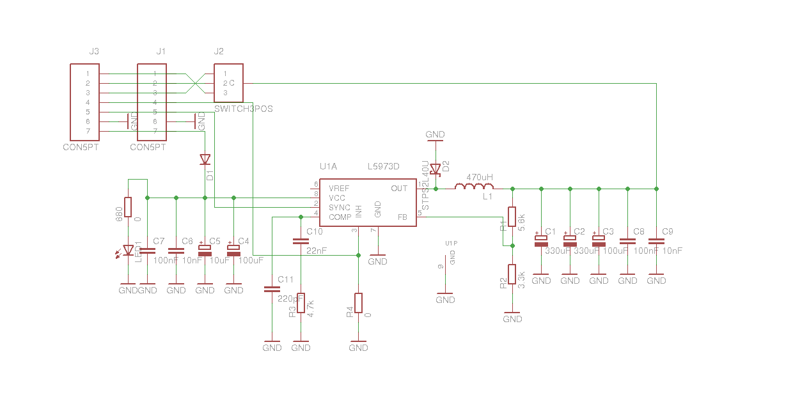
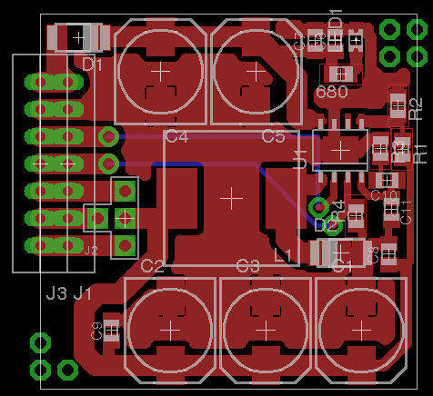

# Le composant

Le composant choisi pour faire l'alimentation du robot est le _L5973AD_ pour plusieurs raisons :

* J'ai eu l'occasion de tester ce composant à plusieurs reprises dans des projets industriel, et il fonctionne bien.
* Avec le même composant, on peut avoir plusieurs tensions de sortie (5V, 10V, etc ...)
* Il permet de faire passer des courants de sortie _correct_ : jusqu'à 2 / 2.5A (en fonction du modèle)
* Il a un bon rendement et chauffe pas trop

# Le schéma

L'idée était d'avoir une carte d'alimentation **générique** pour pouvoir l'utiliser dans plusieurs projets. Avec différentes tension de sortie.

Le schéma n'est pas très jolie (c'est vrai) et pas très compliqué (une fois expliqué) :

## Le connecteur

Lorsque j'ai fait cette carte, je la voulais modulaire. C'est pour cela qu'il y a plusieurs connecteurs :

* J1 et J3 sont des connecteurs (rangée de picots) pour les INPUT / OUTPUT
* J2 est un _sélecteur_ de port de sortie pour l'alimentation : On peut choisir le picot 1 / 2 ou 3 de J1 et J2 comme sortie de l'alimentation, et cela au moyen d'un jumper (modulaire) ou d'un court-circuit.

## L'entrée du circuit

Le circuit peut prendre en entrée une tension comprise entre la tension de sortie voulue (c'est un minimum) et 35V environ. J'ai fait en sorte de protéger le circuit contre l'inversion de polarité, et avoir un petit voyant.

* D1 est une diode de protection : genre on inverse le pôle plus et la masse en branchant le circuit (que celui qui n'a jamais inversé les 2 prise lève la main :) )
* LED1 Permet juste de savoir si le circuit est alimenté (très pratique)
* C4 / C5 / C7 / C8 sont les condensateurs pour stabiliser le tension d'entrée. Si celle-ci n'est pas stable, l'alimentation aura du mal à fonctionner.
    * Les gros condensateurs (en µF) permettent de lisser la tension d'entrée
    * Les petits condos (en nF) permettent de filtrer cette tension

## La sortie

L'objectif étant d'avoir une sortie pouvant aller jusqu'à 2A. Dans le doute, j'ai surdimensionné les condensateurs.

* C1 / C2 / C3 sont là pour réguler la tension de sortie (condensateur ballaste)
* C8 / C9 sont là pour filtrer les parasites

## La régulation

La régulation en elle-même se fait via le chip (L5973AD).

* La diode D2 doit-être une diode Schottky.
* La bobine L1 permet de lisser le courant de sortie. Le calcul de son inductance se fait en fonction du courant de sortie maximum voulue.
* Les composants C10 / C11 et R3 sont là parce ... parce qu'ils doivent être là.
* La valeur de la tension de sortie se choisi avec le pont diviseur R1 et R2
* Pour que la puce soit active, il faut que son _enable_ soit à la masse, d'où la résistance R4 de 0ohm. Mais si on l'enlève, nous avons la possibilité d'activer (ou pas) l'alimentation.
* Enfin, la sortie _SYNC_ de la puce permet de la synchroniser sur une fréquence particulière. Par défaut, c'est l'oscillateur interne qui règle la fréquence de découpage à 500kHz (si cette sortie n’est reliée à rien).

# Le routage

Lorsque j'ai fait ce routage (il y a déjà quelques années), je me suis imposé quelques conditions :

* Avoir la carte la plus petite possible (30x30)
* Faire du simple couche
* Pouvoir la fixer facilement sur d'autres cartes (uniquement par soudure).

Et voilà le résultat :

Le connecteur J3 et les pastilles qui sont à moitié sur la carte, c'est pour pouvoir souder la carte directement sur une autre, sans avoir de picot, mais en utilisant les trous métallisés. Et surprise, lorsque je reçois les cartes fabriquées par PCBPool, pas de trou métallisé. Et c'est normal, j'ai fait que du simple couche. Donc J3 et les pastilles qui sont à moitié sur le circuit ne servent à rien.

J2, c'est juste le _sélecteur_ de sortie. Dans mes cartes, je mets des fils pour choisir une fois pour toute la sortie que je veux utiliser. Mais vous pouvez mettre des picots avec un jumper.

Les 2 pistes que l'autre couche ne servent pas forcément (perso, je ne les ai jamais utilisées). C'est les petits plus de configuration pour des cas particuliers.

Les pastilles reliées à rien sont là uniquement pour la fixation de la carte.

# Les points (très) importants

## Choix des composants

### La bobine

Le choix de la bobine ne se fait pas au hasard. Que ce soit la valeur ou le modèle (suivre l'application note).

Personnellement, il me semble que j'utilisais une B82477P4 de 470uH (ref Farnell : 1644656).

Et c'est en rédigeant cette page que je découvre qu'elle est limitée à 860mA. Il est donc idiot de mettre une grosse inductance pour faire passer beaucoup de courant, alors que la bobine en elle-même ne supporte pas plus de 860mA.

### La diode Schottky

Mon choix c'est simplement porté sur une SKA34A (ref RS : 652-6031) ou une STPS2L40U (en fonction de ce que j'ai en stock).

Et éviter de monter une diode standard à la place de la Schottky. J'ai jamais vérifié à l'oscilloscope la tension de sortie, mais je sais que ça chauffe (et oui, j'ai confondu 2 modèles de diode que j'avais).

## Règles de routage

Il est important de bien respecter les règles de routage fournies par l'application note tel que faire un plan de masse pour dissiper la chaleur de la puce, ou éviter les boucles entre la sortie et l'entrée.

Bref, tout est indiqué dans l'application note

## Régulation de la tension d'entrée

J'ai eu des soucis sur les protos de cette alimentation : ils ne régulaient pas la tension.

Après avoir passé du temps à chercher (avec le meilleur ami de l'électronicien : l'oscilloscope), j'ai fini par trouver : Lorsque je consomme trop de courant, la tension d'entrée du circuit n'était pas stable. Et par conséquent, la sortie non plus.

Il est donc inutile de faire comme moi et rajouter des tonnes de condensateur de lissage en sortie du montage, mais juste en rajouter un en entrée :)

## Petits conseils

Liste de petit conseil pour la fabrication de cette carte (en vrac) :

* Il faut faire vernir la carte pour simplifier le soudage des composants, et éviter les court-circuit sous la bobine ou autre. Le plus simple étant de faire fabriquer la carte chez PCBPool ou seeedstudio.
* Si vous utilisé le jumper pour choisir la _pin_ de sortie, pensez à le fixer avec de la colle ou autre (il serait dommage de le perdre en match.
* Si vous avez plusieurs alimentation à faire (5V et 10V par exemple), utilisez 2 sorties différentes de la carte. Comme ça, si vous vous trompez d'emplacement lorsque vous _plugger_ l'alimentation sur votre carte, vous ne pouvez pas inverser les 2 tensions. Non, ce n'est pas du vécu d'avoir inversé le 5V et 10V ...

## Soudage des composants

Cette carte fonctionne, mais est loin d'être parfaite. Surtout lorsqu'on veut la souder. Il faut avoir un bon fer, et **surtout souder les composants dans un ordre logique**. De mémoire :

* Le L5973AD en premier
* Puis les petites résistances / condo
* Les gros condos
* La diode Schottky
* La bobine en dernier

# Utilisation

J'ai eu l'occasion de tester ce montage dans plusieurs conditions, et j'en suis trés content.

* Il a fait le 5V et 10V de la coupe 2011 dans le robot d'INTech en mode proto pas beau et a parfaitement fonctionnait.
* Il a fait la coupe 2012 toujours avec INTech (2x5V et 10v) avec exactement la carte ci-dessus et a fait son travail à merveille. Jusqu'au jour où, lors d'une démo après la coupe, les 3 cartes sont mortes en même temps. On n'a jamais su ce qu'il s'est passé :
    * Inversion de polarisation (oui, nous n'avions pas monté les diodes de sécurité pour l'inversion de polarité par manque de composant en stock).
    * court-circuit en sortie ?
* La coupe 2013 dans notre robot (5V pour servo moteur et 5V pour Raspberry Pi).
* Enfin, j'utilise aussi ces cartes dans des projets perso (comme l'alimentation d'une Raspberry Pi dans une voiture). C'est génial :)

# Download

voici quelques fichier à télécharger :

* [Le schéma (au format eagle 5.11.0)](alim.sch)
* [Le routage (toujours avec le même format)](alim.brd)
* [Le datasheet du L5973AD](datasheet_l5973ad.pdf)
* [L'application note](application_note_l59763ad.pdf)
