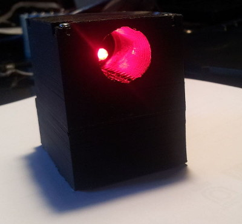
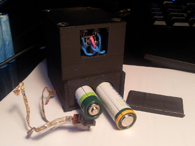
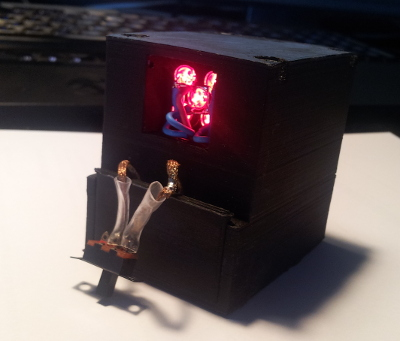
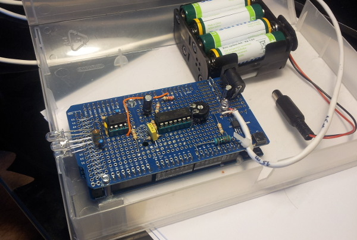
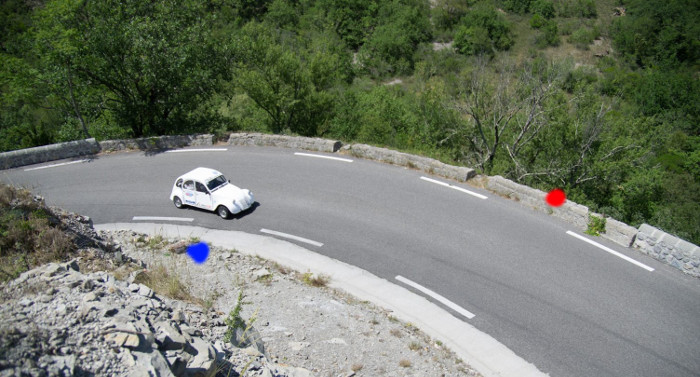
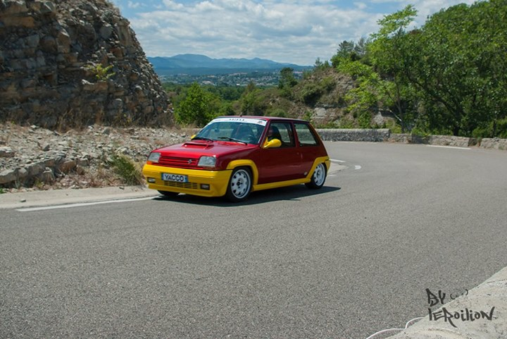
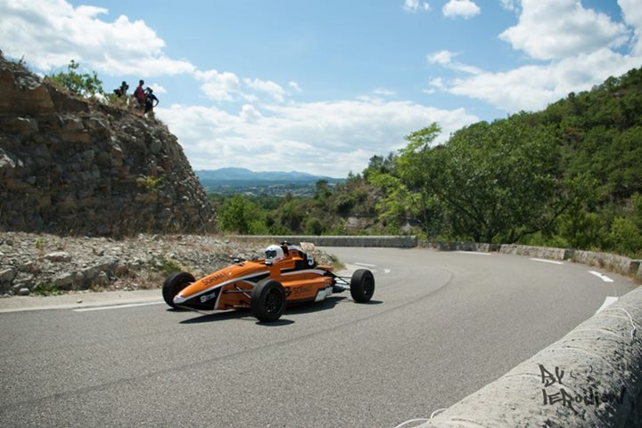
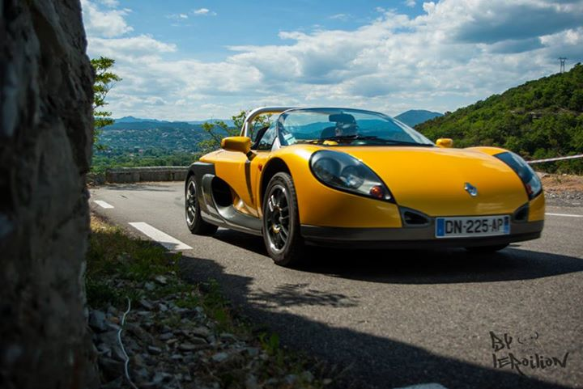
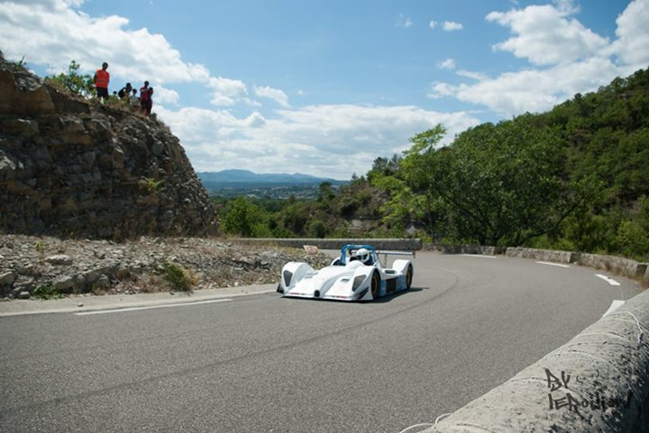

# Qui : #
Jérémy, parce que je fais des rallyes, et que j'aime bien la photographie.

# L'idée : #
Je fais des rallyes. Je fais de la photographie. Alors pourquoi pas faire de la photographie de rallye.

Je trouve facilement l'endroit idéal pour faire une BELLE photo. Le seul problème (problème non négligeable) c'est que c'est aussi l'endroit où la voiture risque de faire une sortie de route. Et ça, ce n'est pas cool pour le photographe :'(.

Autre problème, quand on est trop près, et que les voitures vont vite (c'est un rallye, c'est normal), c'est que j'ai (plus souvent que prévu) que l'avant, ou que l'arrière du véhicule. Hors j'aimerais bien avoir une voitures entière sur la photo ;).

L'idée est donc de prendre ces fameuses photos, sans prendre de risque, et donc de déclencher automatiquement l'appareil photo, pour ne pas prendre de risque pour ma vie, et avoir une photo bien cadrée.

# Le principe #
Le principe de ce système est simple : On place d'un côté de la route un émetteur laser, et de l'autre côté un récepteur. Lorsque le faisceau lumineux est coupé par le véhicule, le piéton, le chat, l'herbe ou le vent (c'est quand même plus dur pour le vent), on prend une photo ou une série de photo.

# Les sources #

Dans toute la suite de l'article on fera référence au code source, au schéma électronique, etc ... Tout est disponible sur mon compte github : [leroilion/declencheurPhoto](https://github.com/leroilion/declencheurPhoto)

# L'émetteur #

L'émetteur est un simple microcontrôleur 8 bits (ATmega328p) qui fait clignoter une série de 5 LEDs rouge hautes luminosités à environ 7kHz (7031Hz pour être exact).

Pourquoi 7031Hz ? Et pourquoi pas ... Je voulais avoir la possibilité d'avoir plusieurs fréquences sans perturbation (pas d'harmonique de Fourier ou fréquences trop proches), pas trop haute fréquence (10kHz maximum) et pas trop basse fréquence (pour avoir une bonne rapidité de détection). J'avais choisi plusieurs fréquences (environ 4kHZ, 5kHz, 6kHz et 7kHz).

Comme pour *décoder* mon signal, j'utilise la TFD (Transformée de Fourier Discrète), je dois choisir parmi un nombre fini de fréquence (que l'on peut calculer). J'ai donc testé avec 7031Hz (fréquence que je peux calculer avec Fourier), et ça a fonctionné, alors pourquoi changer ?

Il n'y a rien d'exceptionnel dans le schéma électronique et le programme pour arriver à faire ça (je vous laisse regarder le code source et le schéma électronique sur mon compte github). En revanche, j'ai passé un peu de temps à *essayer* de faire un boitier bien conçu pour l'installer facilement sur le bord de la route.

Ce boitier (fait en plastique à l'imprimante 3D) est conçu en 2 blocs :

* Le premier bloc contient un *tube* avec les 5 LEDs (pour bien diriger le faisceau de lumière). Ce *tube* est pratique pour permettre de viser : la personne qui est de l'autre côté de la route doit voir 5 LEDs. Si ce n'est pas le cas, c'est que nous ne visons pas au bon endroit, et on peut facilement corriger la direction.

 Ici, nous ne sommes pas bien aligné puisque nous voyons qu'une seule LED.

* Le second bloc contient la carte électronique (qui s'intègre bien dessus) et 2 piles AA (pour alimenter le système).

 Sur cette photo, on peut voir sur le bloc du bas l'emplacement prévu pour mettre les piles.

Les 2 blocs se vissent l'un sur l'autre, et c'est plutôt propre. Il manque juste un système pour faire le contact entre les 2 piles et un interrupteur (que j'ai rajouté *à la rach*).

 Emetteur vu de derrière. On voit bien le recyclage de la tresse à dessouder pour faire le contact entre les 2 piles, avec l'interrupteur soudé.

# Le récepteur #

Comme la balise du robot, le récepteur est composé de capteur (4 LEDs montées en parallèle) suivi d'une chaine d'amplification / filtre. Le tout, entrant dans une entrée analogique d'un Arduino Due.

Malheureusement, je n'ai pas de schéma de cette carte, puisque tout a été fait sur un protoshield Arduino.

Sur la photo, on peut voir : 

* Les capteurs (les 4 LEDs à gauche)
* Les 2 ampli-OP (TL081 et LM324) pour amplifier et filtrer un tout petit peu le signal
* Le bloc d'alimentation (8 piles AA).
* La LED bleu qui permet de savoir si on reçoit le signal de l'émetteur (c'est pratique pour bien mettre le système en place sur le bord de la route).
* Le relais statique (composant CMS en bas à droite du protoshield) qui permet de commander l'appareil photo (qui est connecté au bout du câble blanc).
* La boite : Une boite de cassette VHS (et oui, ça existe encore ces trucs).

Pour le code source (disponible sur le github), c'est simple :

* On initialise le système pour faire des acquisitions analogiques à une fréquence de 100kHz (le résultat étant stocké dans un buffer circulaire).
* Dans la boucle principale, on fait une moyenne sur 5 points pour déclencher l'appareil photo pendant 3 secondes en cas de coupure du faisceau (pour pouvoir prendre les voitures en photos en mode rafale sur l'appareil photo).

La TFD est calculé sur 256 points avec une fréquence d'échantillonnage de 100kHz. Pour le *coefficient* 18, cela correspond à une fréquence de 7031Hz (voila d'ou il sort celui-ci).

# Les problèmes rencontrés #

Le premier problème rencontré lors des tests en extérieur, c'était la portée. Le système avait une portée trop courte. Pour remédier à ce problème, j'ai changé les résistances des LEDs émettrices de 100 ohms à 50. 

Le second problème, c'est que j'avais des valeurs erronées de temps à autres. Et cela déclenche l'appareil photo pendant 3 secondes. Mais durant ces 3 secondes, une valeur aberrante survenait, et le système re-déclencher l'appareil pendant 3 secondes. En gros, l'appareil photo était toujours déclencher. Pour palier ce problème, j'ai simplement rajouté un système de valeur moyenne sur 5 points dans le calcul. Ca avait l'air de fonctionner ...

# Les résultats sur le terrain #

Sur cette photo, on peut voir (avec un beau dessin) l'émetteur (le rond bleu) sur le bord gauche de la route, et le récepteur (le rond rouge) de l'autre côté de la route. L'appareil photo est un peu plus loin (15m) sur le muret. Et on peut aussi voir un magnifique 2CV spéciale (moteur propulsion de 110Cv).

Globalement, les résultats sont encourageants même si tout n'a pas fonctionné à la perfection :

* Les hautes herbes perturbent le système (j'aurais du prévoir un support en hauteur pour placer le système).
* La longueur de mon fils entre le récepteur et l'appareil photo. J'avais prévu 15m pensant que ce serait bien. C'est BEAUCOUP trop court. Je vais donc voir si je peux mettre un système sans fil d'une portée d'environ 50m.
* La distance entre l'émetteur et le récepteur est trop grande sur une vrai route, et j'avais beaucoup de déclenchement, alors qu'il n'y avait pas de voiture. Evidement, cela sature la mémoire de l'appareil photo, et quand passe la voiture, le système à beau le détecter et déclencher l'appareil photo, rien ne se passe. En gros avec 15m de distance entre l'émetteur et le récepteur, le système est instable : parfois ça fonctionne très bien, et parfois, on sait pas pourquoi, ça déclenche en continu.
* Problème de réglage du focus de l'appareil photo (mais ça, ça n'a rien à voir avec le système).

Les améliorations à faire :

* Mettre un système sans fils pour déclencher l'appareil photo pour avoir un meilleur angle de vue.
* Essayer avec un vrai laser plutôt que des LEDs pour créer la barrière lumineuse. 15m, c'est déjà très bien pour des LEDs. Mais c'est légèrement instable et un peu court pour faire ce genre de chose.
* Faire une vraie carte pour la réception avec une teensy 3.1 plutôt qu'un Arduino Due (c'est plus propre et plus petit).
* Faire une boite qui se monte sur un trépied pour les 2 parties.

# L'accident #

Et oui, ça n'arrive pas que dans les films. La voiture numéro 10 (ou un truc comme ça) a fait un tête à queue. Malheureusement, le câble reliant le récepteur à l'appareil photo était par là (oui, la voiture est allé toucher le mur). Et le câble a été sectionné (donc plus de photo pour les 90 voitures qui suivaient).

Mais une pause entre 2 montées, un couteau et on torsade les fils pour raccommoder le système, et c'est reparti pour un tour :)

# Les photos #

Voici quelques photos qui ont été prises avec ce système. Comme je l'ai dit un peu plus haut, le focus n'est pas top, parce que je n'ai pas pensé que la voiture avancé vers l'appareil photo, et donc le focus était fait un peu trop loin.

