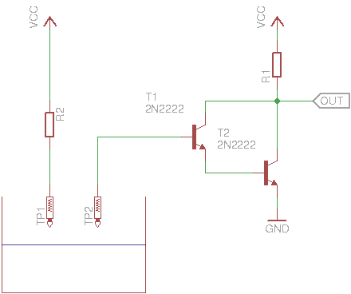
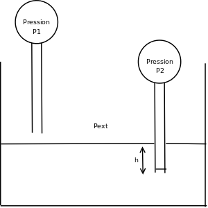
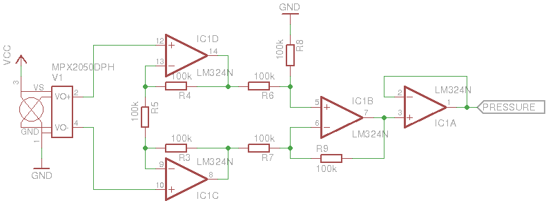

# Qui : #
Jérem, parce que son garage prend l'eau :'(

# L'idée : #
Il arrive régulièrement (et particulièrement cette année) qu'il y ait de forte pluie dans la région de Montpellier. Et malheureusement, le sous-sol du garage de Jérem prend l'eau.

Pour éviter ce problème, il y a des drains, un puisard et surtout, une pompe pour évacuer l'eau. Cette pompe est contrôlée par une Raspberry Pi (via une carte à relais). Mais il faut étudier la météo de la nuit pour savoir s'il va pleuvoir, quand, et en quelle quantité pour faire et lancer le programme adéquat.

L'idée est donc de faire une carte avec des capteurs pour *contrôler* le niveau de l'eau, et l'évacuer de manière automatique.

# Cahier des charges : #

* Connaître le niveau d'eau en temps réel.
* Pouvoir activer / désactiver la pompe manuellement.
* Avoir un système automatique pour vider le puisard.
* Que le tout soit accessible n'importe où dans le monde.

# La réalisation : #

## Les capteurs ##

La première étape consistait à trouver le(s) capteur(s) pour connaître le niveau de l'eau. Pour plus de sécurité et doubler l'information, 2 types de capteurs totalement différent ont été sélectionnés : capteur de conductivité et capteur de pression.

### Capteur de conductivité ###

Le premier type de capteur est le plus simple à concevoir (mais pas forcément le plus simple à installer dans le puisard). Il s'agit simplement de plusieurs capteurs de conductivité électrique à différent niveau.

Le principe est simple, 2 fils face à face. L'un des deux est relié à l'alimentation (via une résistance) et l'autre attaque la base d'un transistor (Darlington pour avoir une meilleure amplification). Le collecteur du transistor est relié à l'alimentation via une autre résistance, et c'est aussi le signal de sorti.

### Capteur de pression ###

Ce second capteur a été rajouté pour doubler l'information, mais aussi pour le fun :).

#### Fonctionnement ####

Sur le schéma, on voit que le premier capteur n'est pas dans l'eau. La pression qu'il mesure (P1) est égale à la pression extérieure (Pext).

Quant au second capteur de pression, il est dans l'eau (d'une hauteur h). La pression qu'il mesure (P2) vaut la pression extérieure (Pext) plus une pression dépendant uniquement de la hauteur d'eau (h).

Donc la pression mesurée par le capteur est : P = Pext + ρ * g * h avec ρ la masse volumique de l'eau, g la gravité et h la hauteur d'eau.

Dans la réalité, avec l'augmentation de pression, l'air va se compresser dans le tube, et donc occuper un volume plus faible. L'eau va donc rentrer dans le tube, ce qui va modifier la hauteur d'eau, et donc la pression (effet que l'on va négliger). 
Dans la pratique, le capteur a été étalonné pour différent niveau d'eau. Cela permet d'observer la linéarité de la pression en fonction du niveau d'eau, et *d'oublier* ce problème de volume qui change.

#### Choix du capteur ####

Le capteur de pression choisi est le MPX10DP parce que :

* Il mesure une pression différentielle : la pression atmosphérique pouvant changer, un capteur de pression absolu aurait des valeurs différentes en fonction de la météo. Et cela fausserai les résultats.
* Il est traversant (c'est plus facile pour prototyper).
* Il est disponible chez RS.

#### Montage ####

Ce capteur fournit une tension différentielle. Il y a un offset de 20mV, et une sensibilité de 3.5mV par kPa (environ 10cm d'eau).

Pour avoir une précision de l'ordre du centimètre, il faut mesurer des tensions d'environ 0.35mV (et l'entré analogique de l'arduino n'est pas assez précise :'( ).

Du coup, un amplificateur de tension différentielle a été rajouté entre le capteur et l'arduino. Il s'agit d'un montage à base d'ampli-Op : le montage amplificateur d'instrumentation .

Le dernier ampli-Op est juste en montage suiveur (il était libre et sur la carte, alors autant l'utiliser). Pour les autres, c'est juste le schéma disponible sur internet. Ce qu'il faut, c'est que R4 = R6 = R8 = R3 = R7 = R9. Comme ça, en changeant R8, on change l'amplification du signal (pour étalonner le montage, R5 a été remplacée par un potentiomètre).

L'intérêt de ce montage, c'est qu'il permet d'amplifier la différence de tension entre les 2 sorties du capteur. Et donc de *supprimer* l'offset.

## L'informatique ##

C'est un ATmega168 (du style arduino) qui récupère les informations des capteurs, et qui les renvoies via liaison série jusqu'à la Raspberry Pi qui contrôle les relais. Et c'est là qu'il faut faire un programme intelligent qui va gérer la pompe.

Les contraintes sont :

* Avoir une interface *sexy*
* Être accessible depuis le monde entier
* Gérer les événements que peuvent arriver de l'ATmega ou de l'utilisateur
* Afficher les informations en temps réel
* Être fun à faire

Le choix c'est donc porté sur nodeJS pour le fun et l'événementiel, twitter bootstrap pour le *sexy* et simple à faire, socket.io pour le temps réel. Bien évidement, il a été rajouté des fonctions pour contrôler les autres relais :).

Le tout, en configurant la box avec une redirection de port pour que le site web soit accessible sur la toile.

## Les problèmes rencontrés ##

Deux problèmes ont été rencontrés (pour l'instant) : la météo et probablement la capillarité du tube sur lequel sont fixés les fils du capteur de conductivité.

### La météo ###

Ce premier problème est arrivé après la première nuit de fonctionnement. Le choix de ne pas déclencher la pompe a été fait, pour observer (via log) la monté du niveau d'eau dans le puisard (il pleuvait cette nuit là).

Sauf que la pression atmosphérique à changer. Du coup, la pression à l'intérieur du *tube* était celle de la veille (qui était plus faible). Et donc, le capteur indiqué un niveau d'eau négatif :'(

Le puisard a été vidé, mais la pression dépression dans le tube à empêché ce dernier de se vider de l'eau qui était à l'intérieur. Il a donc fallu débrancher le tube, et le vider totalement de l'eau avant de remettre le système en place.

Conclusion, il ne faut pas laisser le tube tremper dans l'eau pendant un temps trop long (durant lequel la pression atmosphérique peu changer).

### La capillarité ###

Le capteur de conductivité fonctionnait super bien sur le bureau. Mais une fois installer, ce n'était plus la même chose. Pour comprendre le problème, il faut savoir comment le système a été installé dans le puisard.

Il y a 4 capteurs de conductivité à 4 hauteurs différentes. Et au fond du puisard une grosse électrode globale aux 4 capteurs (avec l'alimentation). Les 4 *fils* qui servent de capteur sont scotché à un tube de plastique qui va jusqu'au fond du puisard.

Jusque là, aucun problème, tout fonctionne bien. Sauf qu'une fois que le capteur du bas a touché l'eau, il reste toujours activé. Même lorsque le puisard est vide.

Actuellement, ce problème n'a pas encore été résolu, mais les doutes se portent sur l'humidité qui resterait sur le tube en plastique, et qui conduirait le courant électrique, alors que le capteur n'est plus dans l'eau. Les pistes pour résoudre ce problème sont : réduire la sensibilité du capteur ou changer la fixation des fils dans le puisard.