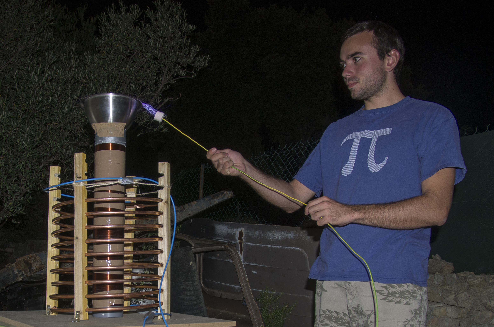
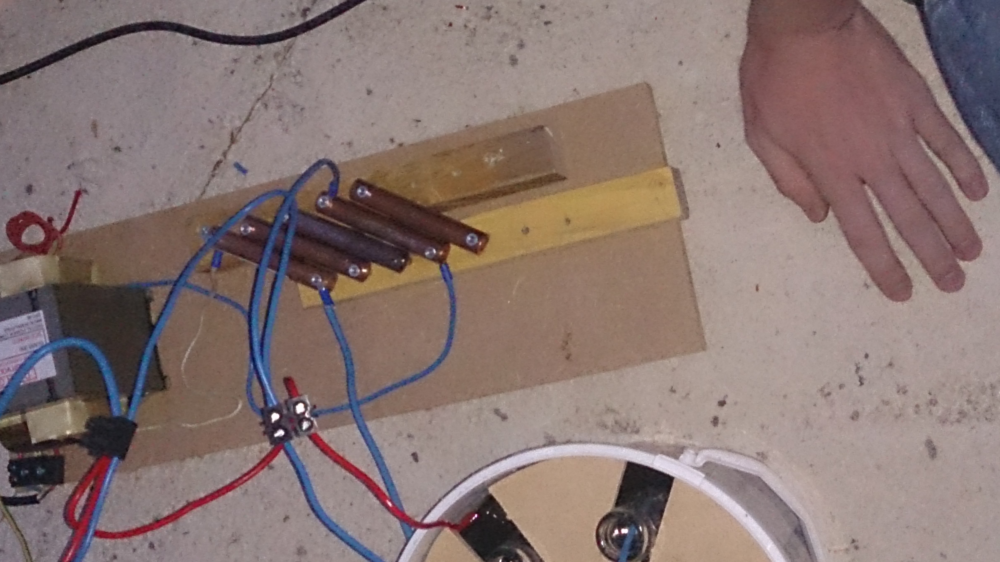
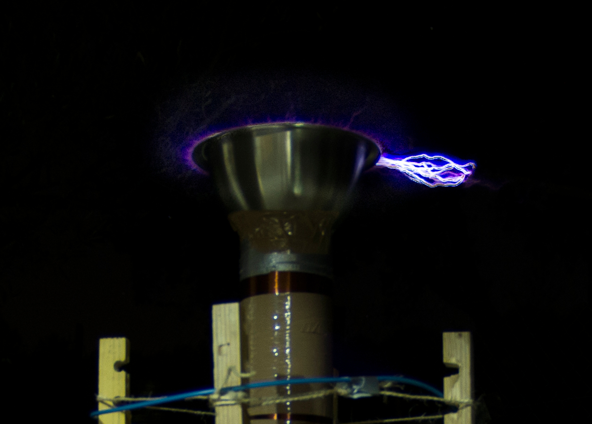
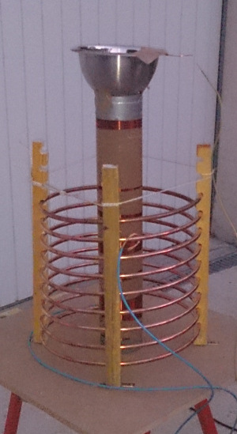

#Qui :
Cassou, Jérémy et Thibault

#Le projet :

Nous avons profité d'une petite semaine de vacances non loin de Montpellier pour assembler une "petite" bobine tesla avec les moyens du bord.

Je ne vais pas faire ici une explication détaillée du fonctionnement de la bobine (de très nombreux sites font ça très bien), mais lister les matériaux utilisés, les problèmes rencontrés et les améliorations possibles pour la v2.

#Composants utilisés :

### Bobine primaire
10M de tube de cuivre de 10mm, acheté en rouleau.

###Bobine secondaire

~400m de fil émaillé de 0.4mm enroulé sur un tube PVC de 100mm de diamètre.
Le bobinage (>1300 spires) a été fait à la main, une personne fait tourner le tube tandis qu'une autre guide le fil pour obtenir un bobinage dense. Le processus a pris 3h environ, c'est l'étape la plus longue de la construction.

###Condensateur primaire

Nous avons utilisés une vingtaine de bouteille de soda en verre réparties dans 3 seaux. Les bouteilles et seaux sont remplis d'eau saturée en sel, et quelques millimètres d'huile (de moteur de récupération, bien crade...) ont été versés à la surface pour améliorer l'isolation et éviter l'évaporation de l'eau.

Dans chaque bouteilles et seaux trempent des fils de cuivre dénudés afin de raccorder le condensateur au reste du circuit.

Nous avons mesuré 14nF aux bornes du condensateur.

###Transformateur

Nous avons utilisé un transformateur de micro-onde. 200V en en entrée, 2kV en sortie...Attention à ne pas laisser les doigts traîner n'importe où !

###Eclateur

Une série de tubes de cuivre de 12mm montés sur un parallélogramme. Ce montage permet de régler assez facilement l'écart entre les bornes de l'éclateur.
L'assemblage ayant été fait trop rapidement, le parallélisme laissait à désirer et le réglage était plus qu'approximatif.

###Condensateur secondaire
Un bol en inox acheté en grande surface.

###Chassis, support

Quelques planches et tasseaux de récupération.

#Conclusion

##Le résultat

Nous avons réussis à obtenir des arcs d'une quinzaine de centimètre en approchant un fil de terre.

Le réglage progressif de la borne mobile de la bobine primaire a rapidement mis en évidence qu'elle était trop courte pour obtenir l'accord idéal entre primaire et secondaire. Nous avons partiellement compensé ce défaut en augmentant la capacité du condensateur primaire de quelques bouteilles, sans jamais pouvoir atteindre l'accord parfait.

De plus la tension délivrée par le transformateur de micro-onde est un peu "faible" (2KV).

##Améliorations possibles

Nous ne modifieront probablement plus cette bobines, nous avons appris beaucoups de choses et fabriquerons une nouvelle bobine tirant parti de ces enseignements.

* 2kV, c'est un peu trop faible, nous allons nous procurer une alimentation d'enseigne à néon (NST).
* le condensateur à base d'eau salée et d'huile n'est pas très pratique et transportable, nous allons tenter d'en fabriquer un solide
* la géométrie de l'éclateur doit être propre pour un réglage optimal
* l'éclateur doit être refroidis, sinon les arcs stoppent au bout de quelques secondes.
* la bobine primaire sera faite à plat, et non vertical (ici nous n'avions pas l'équipement nécéssaire pour cintrer le tube de cuivre à la forme voulue).

